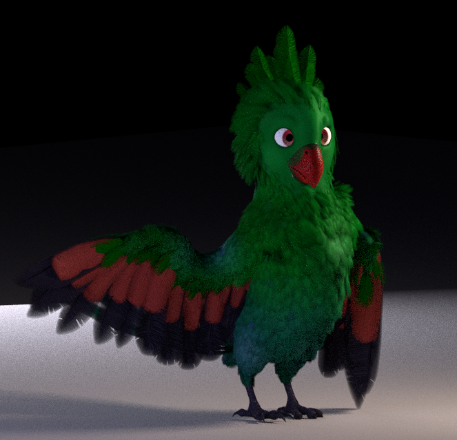
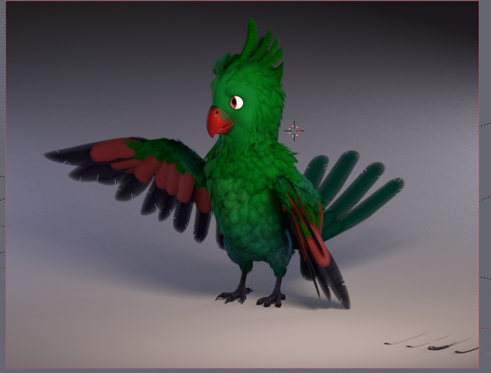
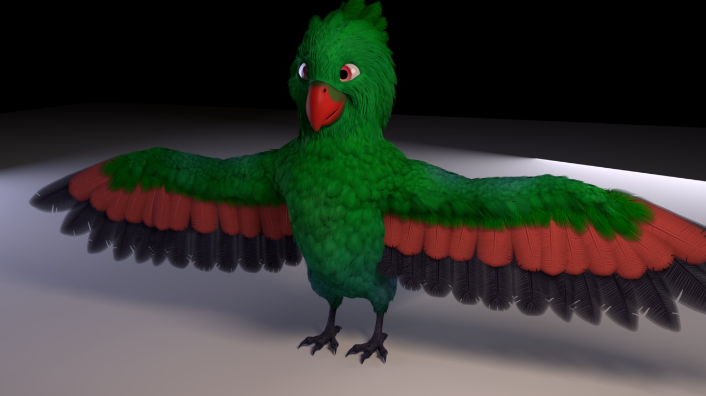
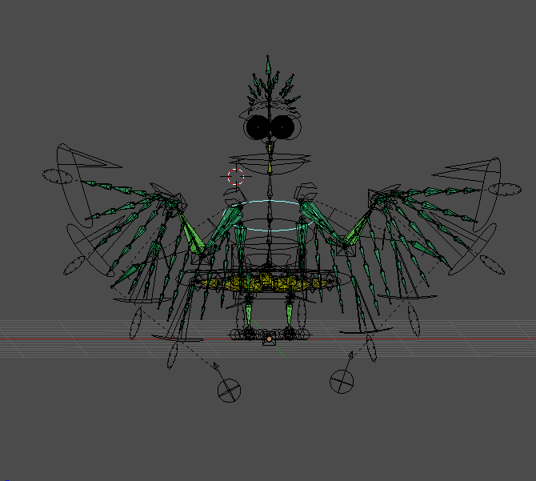
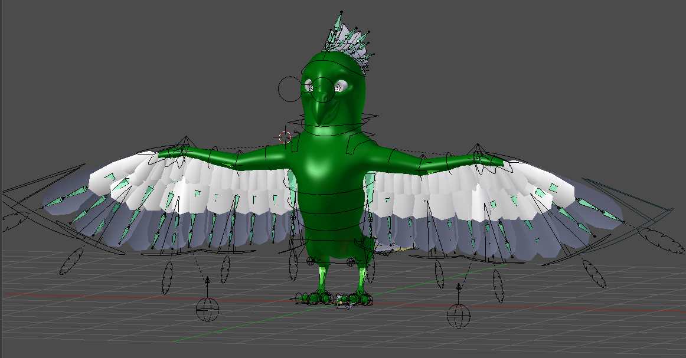

### 3D Graphics

In addition to my work at school, I am taking classes on 3D art and animation online as a hobby. The website [CG Cookie](https://cgcookie.com/) offers a great tutorial called the "Piero Tutorial," which runs through the process of sculpting, rigging, and animating a cartoon bird. Below is my progress in the course, with my own model created from scratch, as an interpretation of the bird in the tutorial. At the bottom, you can view the tutorial's take on the bird if you click the YouTube link.

#### Quick renders 

### Full render and armature

### Tutorial source

### Character Art
