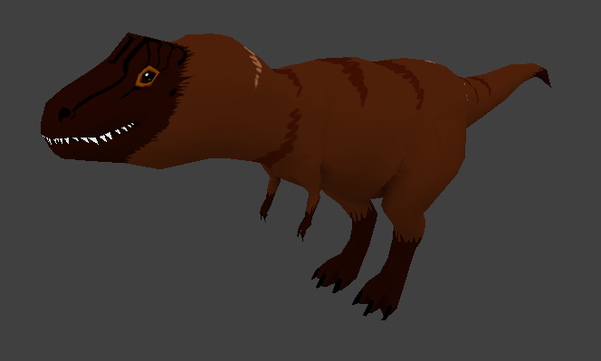

# Graphic Design

### 3D Graphics

In addition to my work at school, I am taking classes on 3D art and animation online as a hobby. The website [CG Cookie](https://cgcookie.com/) offers a great tutorial called the [Piero Tutorial,](https://www.youtube.com/watch?v=zHlsQSM0Pvc) which runs through the process of sculpting, rigging, and animating a cartoon bird. Below is my progress in the course.

#### Quick render

#### Full render and armature

#### Low Poly T-Rex

