# Photo Album

This portion of the webpage exists so you can learn a little bit more about me, and the things I enjoy outside of my research.

## Birds of Prey

I worked at the [Rocky Mountain Raptor Program](https://www.rmrp.org/) for 5 years starting in 2010. Here is a younger me enjoying my time with the eagles and owls! Volunteering as a raptor handler and public educator is one of my most proud achievements. I really enjoyed teaching the public about birds and the spaces they live, and fundraising to help get releasable birds back to the wild. (All the birds in the pictures are non-releasable educational birds, who could not be returned to the wild because of various injuries.)

### A feeding session with the elderly Golden Eagle male

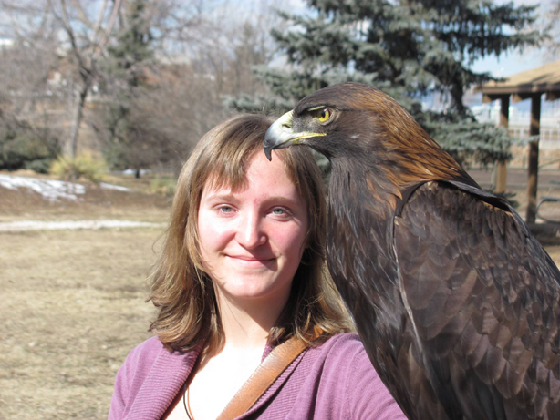
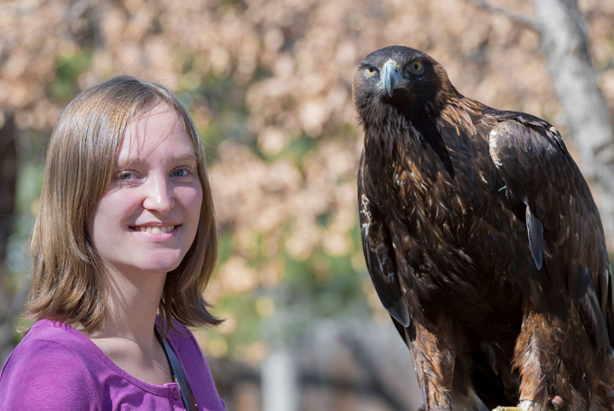
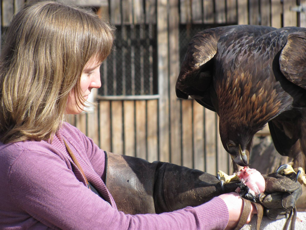

### Attending the annual auction fundraiser event with coworkers

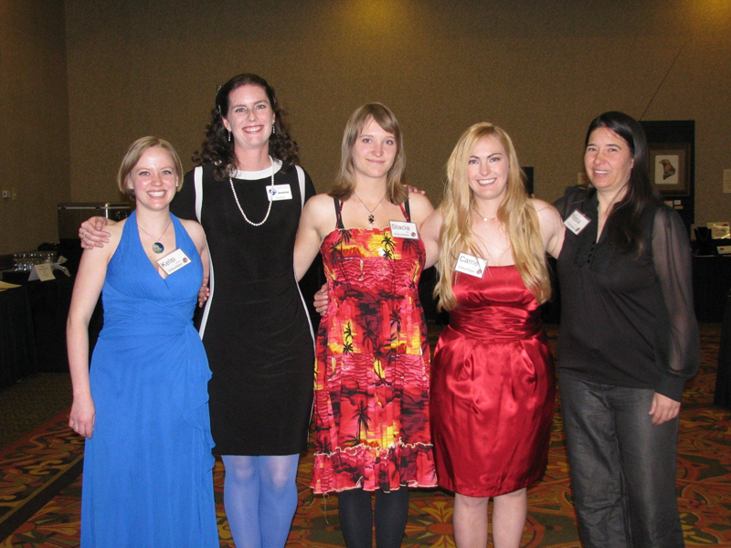
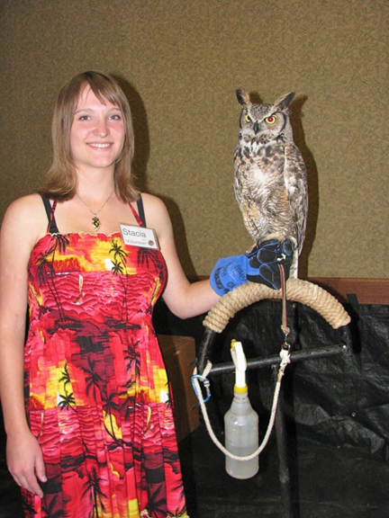

## Pepper Robot

The [MirrorLab](http://mirrorlab.mines.edu/) recently acquired a model of the Pepper Robot, imported from Japan. During my first semester at Mines, I programmed various interfaces to allow our lab's robot architecture to control the robot. Most recently, I have been overseeing the interface's completion. (More technically, the interface is a wrapper class that allows the MirrorLab's DIARC architecture to call the native API on the Pepper robot, allowing us to customize the robot's behavior for lab tests.)

### Hanging out with lab mates in the robot room

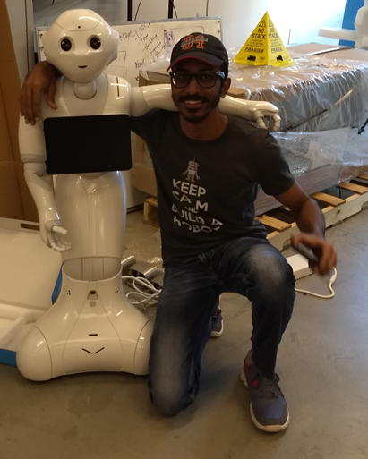
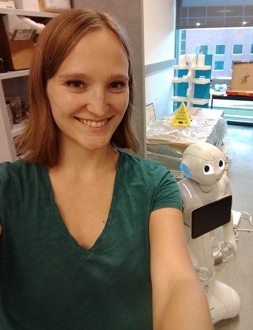

## Campus events

The Colorado School of Mines is a wonderful, rigorous university with tons of opportunities to meet other students and attend various events. I enjoy hanging out with my friends from the university, and drawing from their incredibly diverse knowledge of computer science!

### Come for the robots, stay for the people

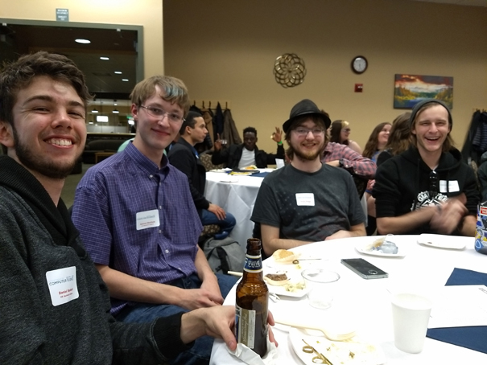
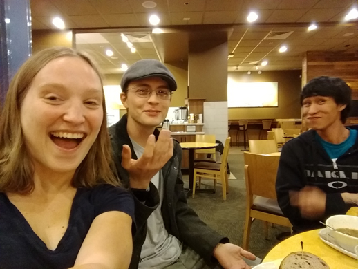

## Outdoors

Colorado is a great place to hike and adventure in the outdoors. I find that time away from the computer helps me think, and my brain will often solve a coding problem on its own if I take some time to step away. I enjoy hiking, and observing the diverse ecosystem of my home state.

### Natural landscapes and their inhabitants

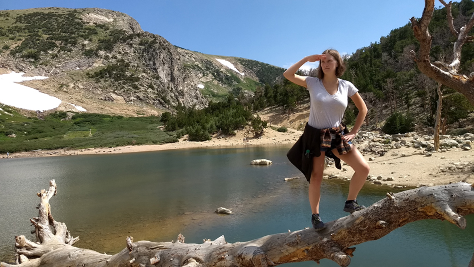
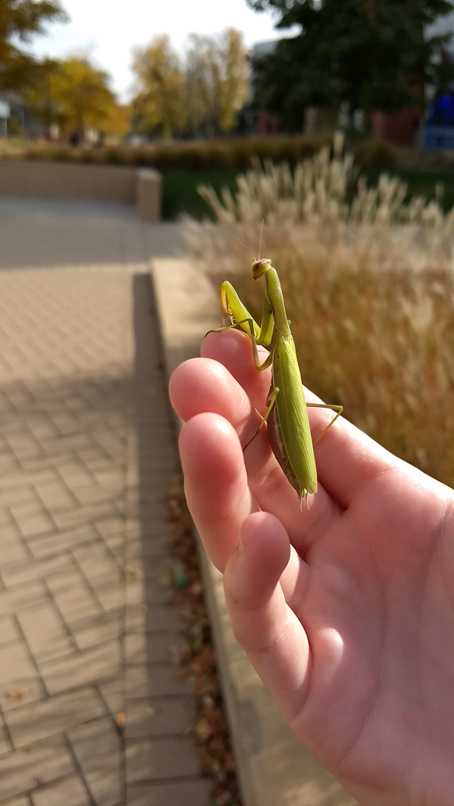

### My aunt's puppy, who also gives me an excuse to go adventure outside

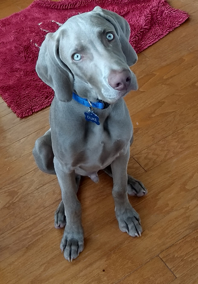

## Other

As a graduate student, I find myself incredibly busy during the semester. Getting out and seeing what the world has to offer outside the bubble of university helps me maintain well rounded interests. Not to mention that I will often get the most inspiration for my software projects away from the computer, where new ideas will have room to sink in.

My [graphic design](/graphics/) hobby has a whole page dedicated to it, since it is my greatest passion outside school. I am interested in 3D art and 2D visual design. These skills will go a long way in allowing me to develop software that is usable, intuitive, and visually appealing.

If you would like to learn more about my interests and skills, don't hesitate to [contact me](/contact/)!

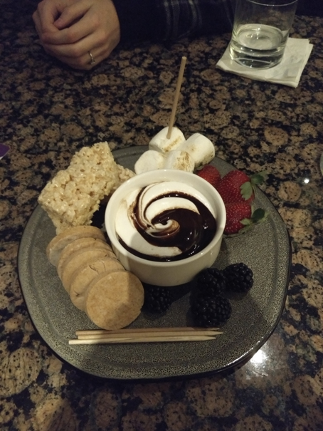

