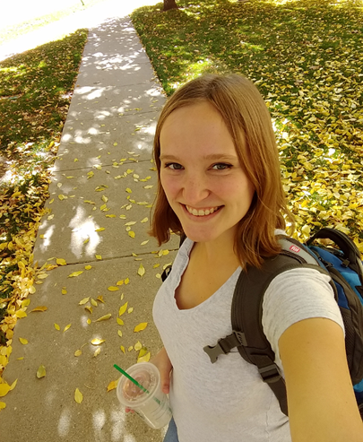

# Home 

## About Me

I'm a master's student at the Colorado School of Mines, completing a major in Computer Science. My specialties are Machine Learning, Natural Language Processing, and Robotics. To learn more about the robotics reasearch I am doing, feel free to visit my [Software Page](/software) and the [MirrorLab](http://mirrorlab.mines.edu/people.html) website. We are developing new and exciting technologies in the field of Human Robot Interaction, and applying our discoveries to robotic systems.

I attended Colorado State University in undergraduate, and majored in Biology with a minor in Mathematics. I have extensive experience applying biological concepts to the field of software. By imitating biological systems, we can bring the simplicity and elegance of nature to our software designs. For instance, neural networks were conceived of by simplifying the structure of the brain, and are now a basic tenent of machine learning. I hope to continue finding ways to combine my passion for biology with my passion for software.

## Skills

*   Java, Python, C++, Matlab, MIPS Assembly Language
*   OpenCV, Linux OS, Windows OS
*   Visual Studio, Eclipse, Github
*   Website design in Jekyll, and some HTML
*   Public education (served as birds of prey rehabilitator & public educator for 5 years)
*   Customer service (restaurant manager for nearly a year)
*   Communication with clients (referred clients to attorneys at a law firm for a year, answered phones daily)
*   Microsoft Suite: Word, Excel, PowerPoint
*   Graphic designer: Adobe Photoshop expert, student of 3D design in Blender

## Courses

*   Computer Organization, Discrete Mathematics, Software Engineering
*   Algorithms, Computer Vision, Simulation, Machine Learning, Robot Architectures
*   Natural Language Processing for HRI, Human Centered Robotics, Operating Systems, Applied Machine Learning

