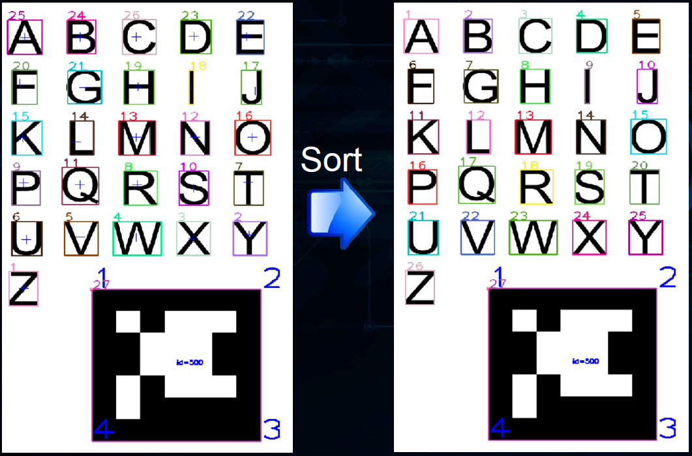

# Software Projects

### [](#top)Jump to Project:

| | | |
|:-:|:-:|:-:|
| [](#custom-neural-network) <br> Custom Neural Network| [](#pepper-robot-interface) <br> Pepper Robot Interface| [](#text-recognition) <br> Text Recognition  |
| [](#ar-with-computer-vision) <br> AR with Computer Vision| [](#card-game-players) <br> Card Game Players| [](#crosswalk-simulation) <br> Crosswalk Simulation |


* * *
### [](#neuron)Custom Neural Network

#### Summary
I created a neural network from scratch in Java. This was for a Machine Learning class, and increased my familiarity with ML techniques at the software level. The neural network trains on the XOR problem with high accuracy after 1000 iterations on the training set. A framework for the categorization of images is included, but training the neural network to categorize the facial expression in each image is very limited (because the network only has three layers of neurons: input, hidden layer, and output). Future work would extract feature components from the image rather than passing it in pixel by pixel to the neural network.
#### Skills
Java Programming, Machine Learning, Neural Networks, AI, Back Propagation Algorithm
#### Code
[GitHub Link](https://github.com/nearsr/NeuralNetwork)
#### Output
Example output for one training cycle:

```
...

Input 2: x[0] = 0.0; x[1] = 1.0
Layer 1
Output length: 3
Output: [0.9909638452921066, 0.9988092353512013, 0.08782025529450274]
Layer 2
Output length (should be one): 1
Final output: [0.9122871680993453]
VALIDATING Expected Output: [1.0]

Input 3: x[0] = 0.0; x[1] = 0.0
Layer 1
Output length: 3
Output: [0.5951240590170185, 0.7280678267260047, 0.7066527900752855]
Layer 2
Output length (should be one): 1
Final output: [0.05795362104051943]
VALIDATING Expected Output: [0.0]


Running XOR test: true
Allowing sunglasses: true (image training only)
totalNum 0 num to use for train 0 num for check 0
Validations correct: 4 Total number of validations: 4
% of validations correct: 1.0
```
[Top](#jump-to-project)
* * *

### [](#pepper)Pepper Robot Interface

#### Summary
DIARC is a robot architecture being designed in the MirrorLab to support complex behaviors in robotic systems. ADE is the code base that implements it. Using the NaoQi API that is built into the Pepper robot, we wrote our own code to operate it. This code acted as a wrapper class that made it easy for the ADE architecture to send commands to Pepper and build more complex behaviors using the goal manager. It was an excellent exercise in complex code bases, and we have the basic functions of the robot online.
#### Skills
Java, Robot Architectures, Wrapper Classes, API Interfaces, ADE/DIARC, Naoqi API
#### Output

Click image to watch.

[](https://www.youtube.com/watch?v=SDd-zvKxOgc)

[Top](#jump-to-project)


* * *

### [](#readingRobot)Text Recognition

#### Summary
Using skills acquired over a semester of learning Computer Vision techniques, we created a final project that recognized text from a webcam feed. The computer then read the text out loud to the user. The program is limited to large cue cards as pictured below, with ARUCO markers attached. This project could be expanded to not require ARUCO markers, but their presence helps greatly simplify processing. The project was designed with the motivation of eventually teaching a robot to read cue cards out loud, and our code can certainly be extended for this application.
#### Skills
C++, Computer Vision, OpenCV, OCR, Template Matching, Project management
#### Code
[GitHub Link](https://github.com/nearsr/CompVisionFinal)
#### Output
We trained the algorithm on the letters using simple template generation.
OpenCV was used to find the bounding box of each letter, and sort them in the correct order.



The output for the first cue card was spot on.


Sometimes the algorithm failed.
Template matching is not robust to variation -
feature matching or neural networks would provide
a more robust solution in practice.


[Top](#jump-to-project)


* * *

### [](#hologram)AR with Computer Vision

#### Summary
I used OpenCV in Matlab to mark the location of a door handle (yellow) and hinge (green). Two ARUCO markers are discovered by the computer, which uses their pose in 3D space relative to the camera to determine where in 2D camera space the hinge and handle will appear. The program draws the colored markers based on transformations between 2D and 3D space. AR is a growing field and has many applications for assistive technologies.
#### Skills
Matlab, Computer Vision, OpenCV, Augmented Reality, Image Processing
#### Output
Click image to watch.

[](https://www.youtube.com/watch?v=9ua0_SmOqjM)


[Top](#jump-to-project)


* * *

### [](#cards)Card Game Players

#### Summary
I simulated two card games - War and Trash. It challenged my code architecture skills, and my ability to encapsulate everything succesfully. The program had many layers. There were objects to represent the card decks, the players, and even a wrapper class outside the simulation to run it multiple times in order to compute important values with high accuracy. We collected statistics to determine what the average number of turns were in each game, and when in the game the last "winner transition" happened (which player is ahead in terms of points). This could be used as a measure of "fun" for each game, on the assumption that the more fun game will have more winner transitions in the late game because that is more exciting. We concluded that Trash is more "fun" because War tended to go on for more turns and have a lower chance of the uderdog gaining the upper hand later in the game. Trash went on for fewer turns and had a higher likelihood that the winning and losing parties could switch places late in the game.
#### Skills
Java, Simulation, Monte Carlo, Statistical Analysis, Random Variate Generation
#### Code
[GitHub Link](https://github.com/nearsr/War_and_Trash)
#### Output
I compared my output, in red, to the professor's output in blue. My output was remarkably close. To ensure that the confidence intervals were what was expected based on the difference between my and the professor's results, I computed the expected values based on the gaps in the final values. The results are below. The confidence intervals for the computed values were correct based on the results output by my simulation.


[Top](#jump-to-project)


* * *

### [](#crosswalk)Crosswalk Simulation
#### Summary
This is the most complex simulation I have built to date. It had many moving parts - pedestrians walking in both directions and cars moving across a road, both of which had to obey the traffic signs that would either delay them or allow them to pass. Velocities had to be accounted for, and so did modified departure times when a car did get delayed. The simulation's goal was to set up an environment in which different factors could be changed to see how they effected the delay of the various travelers. We calculated both pedestrian and auto delay. The simulation was analyzed under starting conditions, but any of the parameters can easily be tweaked to see how the results are effected. The simulation makes many simplifications, but a system similar to this one could be used to aid engineers in constructing roads, and deciding on traffic patterns. This was a group project that took a lot of coordination to bring to completion, but was ultimately successful.
#### Skills
Python, Simulation, Encapsulation, Complex Architectures, Teamwork
#### Code
[GitHub Link](https://github.com/nearsr/CrosswalkSIM)
#### Output
The professor's expected output in blue, vs. our crosswalk program's output in red. This served as a simple form of validation on our results. In reality, there is no standard bar to compare a simulation to. Instead, simulations require extensive double checking to ensure their accuracy. One method is to run sanity checks on the numbers to see if tweaking important variables leads to expected outputs. Another is to compare to real world data, and see if the simulation's output is sensible.


[Top](#jump-to-project)
