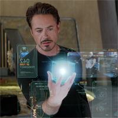

### Jump to Project:

| | | |
|:-:|:-:|:-:|
|    Custom Neural Network|    Pepper Robot Interface|    Text Recognition  |
|    AR with Computer Vision|    Card Game Players|    Crosswalk Simulation |

* * *
### Custom Neural Network

#### Course
Machine Learning, Fall 2017
#### Skills
Java Programming, Neural Networks, AI, Back Propagation Algorithms

[Top](#jump-to-project)

* * *

### Pepper Robot Interface

#### Course
Robot Architectures, Independent Study, Fall 2017
#### Skills
Java, Robotics, Wrapper Classes, Robot Interfaces, ADE/DIARC, Naoqi API

[Top](#jump-to-project)

* * *

### Text Recognition

#### Course
Computer Vision, Fall 2017
#### Skills
C++, Matlab, OpenCV, Template Matching, OCR, Project management, Teamwork

[Top](#jump-to-project)

* * *

### AR with Computer Vision

#### Course
Computer Vision, Fall 2017
#### Skills
Matlab, C++, OpenCV, Augmented Reality, Image Processing

[Top](#jump-to-project)

* * *

### Card Game Players

#### Course
Simulation, Fall 2017
#### Skills
Java, Simulation, Monte Carlo, Sorting Algorithms, Random Variate Generation

[Top](#jump-to-project)

* * *

### Crosswalk Simulation

#### Course
Simulation, Fall 2017
#### Skills
Python, Simulation, Encapsulation, Complex Architectures, Teamwork

[Top](#jump-to-project)
