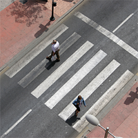

### [](#top)Jump to Project:

| | | |
|:-:|:-:|:-:|
| [](#custom-neural-network) <br> Custom Neural Network| [](#pepper-robot-interface) <br> Pepper Robot Interface| [](#text-recognition) <br> Text Recognition  |
| [](#ar-with-computer-vision) <br> AR with Computer Vision| [](#card-game-players) <br> Card Game Players| [](#crosswalk-simulation) <br> Crosswalk Simulation |


* * *
### [](#neuron)Custom Neural Network

#### Summary
I created a neural network from scratch, coding in Java after starting from nothing. This was for a Machine Learning class, and increased my familiarity with ML techniques at the software level. The neural network trains on the XOR problem with high accuracy after 1000 iterations on the training set. A framework for the categorization of images is included, but training the neural network to categorize the mood someone is in in each image (which has only one layer in addition to input and output) is very limited. Future work would extract feature components from the image rather than passing it in pixel by pixel to the neural network.
#### Skills
Java Programming, Machine Learning, Neural Networks, AI, Back Propagation Algorithm
#### Code
[GitHub Link](https://github.com/nearsr/NeuralNetwork)
#### Output
Example output for one training cycle:

```
...

Input 2: x[0] = 0.0; x[1] = 1.0
Layer 1
Output length: 3
Output: [0.9909638452921066, 0.9988092353512013, 0.08782025529450274]
Layer 2
Output length (should be one): 1
Final output: [0.9122871680993453]
VALIDATING Expected Output: [1.0]

Input 3: x[0] = 0.0; x[1] = 0.0
Layer 1
Output length: 3
Output: [0.5951240590170185, 0.7280678267260047, 0.7066527900752855]
Layer 2
Output length (should be one): 1
Final output: [0.05795362104051943]
VALIDATING Expected Output: [0.0]


Running XOR test: true
Allowing sunglasses: true (image training only)
totalNum 0 num to use for train 0 num for check 0
Validations correct: 4 Total number of validations: 4
% of validations correct: 1.0
```
[Top](#jump-to-project)
* * *

### [](#pepper)Pepper Robot Interface

#### Skills
Java, Robot Architectures, Wrapper Classes, API Interfaces, ADE/DIARC, Naoqi API

[Top](#jump-to-project)


* * *

### [](#readingRobot)Text Recognition

#### Skills
C++, Computer Vision, OpenCV, OCR, Template Matching, Project management

[Top](#jump-to-project)


* * *

### [](#hologram)AR with Computer Vision

#### Skills
Matlab, Computer Vision, OpenCV, Augmented Reality, Image Processing

[Top](#jump-to-project)


* * *

### [](#cards)Card Game Players

#### Skills
Java, Simulation, Monte Carlo, Sorting Algorithms, Random Variate Generation


[Top](#jump-to-project)


* * *

### [](#crosswalk)Crosswalk Simulation

#### Skills
Python, Simulation, Encapsulation, Complex Architectures, Teamwork


[Top](#jump-to-project)
